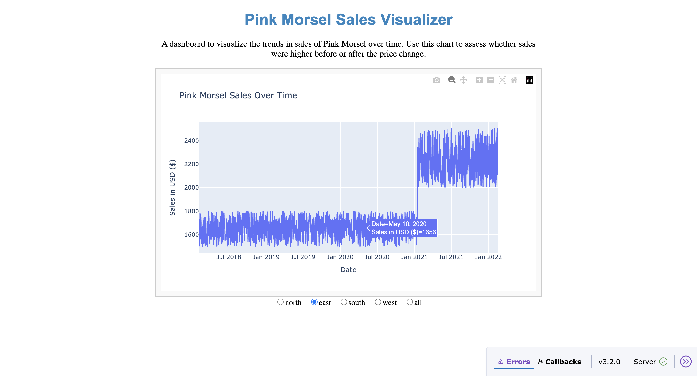

## Interactive Pricing Strategy & Sales Analysis Tool
An interactive Dash web application built during the Quantium Software Engineering Job Simulation (Forage). This tool allows stakeholders to model price changes and instantly visualize their impact on sales and profitability, enabling faster, data-driven pricing decisions.

**Features**
Scenario Simulation: Adjust price parameters to instantly see the effect on sales and profit.

Real-Time Visualizations: Interactive charts powered by Plotly for clear insights.

Automated Testing Pipeline: Built with Pytest and a bash script for quick verification of app performance.

User-Friendly UI: Intuitive, engaging, and responsive design for non-technical users.

**Tech Stack**
Frontend & Backend: Dash (Python)

Data Manipulation: Pandas

Visualization: Plotly

Testing: Pytest

Automation: Bash scripting

Data Validation: Python

**Screenshots**
 

## Project Structure
```bash
.
├── app.py                 # Main Dash application
├── tests/                 # Pytest test suite
├── run_tests.sh           # Bash script to run tests
├── requirements.txt       # Project dependencies
├── README.md              # Project documentation
└── data/                  # Sample datasets
```

**Expected Impacts**
- Reduce pricing analysis time from hours to minutes.

- Improve decision-making accuracy by providing instant feedback on pricing changes.

- Increase reliability through automated testing before deployment.

